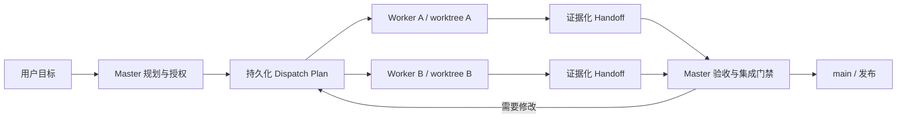

# multi-worktree-release

一个面向 Codex 的协作治理 Skill，用来安全地组织多个持久任务与 Git worktree：由 Master 负责规划、授权和集成，Worker 在隔离工作树中实现，交付前通过明确的状态、证据和质量门禁完成验收。

它解决的不是“怎样多开几个任务”，而是多任务长期协作中更容易出错的部分：任务边界漂移、授权不清、上下文丢失、重复派发、错误合并，以及发布前无人能说清当前状态。

## 适合什么场景（严格协作路径）

适合：

- 一个主任务协调多个长期存在的 Codex 任务；
- 每个实现任务拥有独立 Git worktree；
- 需要分批开发、审查、集成并最终发布；
- 希望任务在对话轮换、Codex 重启后仍可恢复；
- 需要默认拒绝外部写操作，并明确记录授权边界。

不适合：

- 普通的单分支、单任务开发；
- 只想临时并行处理几个互不相关的小问题；
- 用流程文档代替真实的代码审查、测试或生产权限系统。

## 选择路径

简单、低风险、可在当前任务和工作目录完成的改动走 **FAST**：分类 → 修改 → 本地验收 → 提交 → 已有明确授权则推送，否则先请求授权。
需要并行协作、额外工作目录、协议或权限变更、持久状态、发布或生产操作、不可逆修改、长期恢复，或分类不确定时，升级到现有严格流程。
FAST 不改变外部操作权限，也不会让用户承担内部协调记录；普通无关的单分支编码请求不会因此触发本 Skill。

轻量化采用阶段、Pilot 标准和完整 v2 停止边界见 [ROADMAP.md](ROADMAP.md)。

## 它提供什么

- **Master / Worker 分工**：Master 拥有计划、派发、验收与集成权；Worker 只处理已授权任务。
- **持久化 Dispatch Plan**：默认把机器可读的协调状态保存到 Master 工作树，而不是只留在对话中。
- **Durable Worker Card**：每个 Worker 都有可恢复的任务卡，包含目标、边界、修订号、预算与授权。
- **稳定的消息身份**：消息由任务、任务规格修订号与发布源共同标识，并用规格摘要约束重复投递。
- **修订传播规则**：影响任务语义的计划变化必须同步提升对应的 `task_spec_revision`。
- **交付与集成门禁**：要求证据、测试、工作树清洁度和依赖状态达到约定标准后再集成。
- **默认拒绝外部操作**：没有明确授权时，不允许推送、发布、发消息、改远端状态或产生额外费用。
- **可执行校验器**：检查模板、JSON Schema、修订语义和关键契约是否一致。

## 工作方式



核心原则很简单：

1. Master 先把目标拆成有边界、可验收、可恢复的任务。
2. Dispatch Plan 落盘，并为每个 Worker 建立任务卡。
3. Worker 只在自己的 worktree 中完成被授权的工作。
4. Worker 用结构化 handoff 交付结果、测试证据、风险和提交信息。
5. Master 独立验证，通过集成门禁后再合并到 `main`。

完整方法见 [references/methodology.md](references/methodology.md)。

## 安装

### 方式一：直接安装

适合只想使用 Skill 的用户：

```bash
git clone https://github.com/LDH0218/multi-worktree-release.git ~/.codex/skills/multi-worktree-release
```

安装后重启 Codex，使 Skill 被重新发现。

### 方式二：开发目录与安装目录分离

适合维护或修改这个 Skill。先把仓库克隆到普通项目目录：

```bash
git clone https://github.com/LDH0218/multi-worktree-release.git ~/Projects/multi-worktree-release
```

再把安装位置链接到维护目录：

```bash
mkdir -p ~/.codex/skills
ln -s ~/Projects/multi-worktree-release ~/.codex/skills/multi-worktree-release
```

这样只维护一份源码：在项目目录中提交和推送，Codex 使用的始终是同一份最新内容。创建链接前，请确认 `~/.codex/skills/multi-worktree-release` 不存在，避免覆盖已有安装。

## 快速开始

在 Codex 中显式调用 Skill：

```text
$multi-worktree-release 审查这个仓库是否适合采用 Master/Worker 多工作树流程，并给出采用计划。
```

也可以直接描述操作目标：

```text
$multi-worktree-release 为这次版本开发建立 Dispatch Plan，把前端和后端拆给两个 Worker，并定义集成门禁。
```

```text
$multi-worktree-release 检查所有 Worker 的 handoff、验证证据和工作树状态，告诉我现在是否可以集成到 main。
```

常见使用模式包括：

- **Audit**：审查现有仓库、任务和工作树，找出协作或发布阻塞项；
- **Design**：设计任务拆分、依赖关系、授权范围与验收标准；
- **Adopt**：为已有项目建立持久状态文件和 Worker 任务卡；
- **Operate**：派发、跟踪、恢复、验收和集成多任务交付；
- **Review**：检查流程契约、模板和状态是否互相一致。

## 持久状态放在哪里

默认状态文件位于 Master 工作树：

```text
<MASTER_WORKTREE>/.codex/multi-worktree-release/dispatch-plan.json
```

每个 Worker 的可恢复任务卡默认位于其工作树：

```text
<WORKER_WORKTREE>/WORKTREE_TASK.md
```

Dispatch Plan 是跨任务协作的机器契约，至少记录：

- `release_task_id`、语义 `plan_revision` 与每次写入递增的 `record_revision`；
- 每个任务的 `task_id` 与 `task_spec_revision`；
- Worker、分支、worktree、状态和依赖；
- 验收标准、验证命令与证据；
- 外部操作、费用、fresh run 和 resume 授权；
- handoff 与集成结果。

如果项目不能提交 `.codex/` 状态目录，应在 `.gitignore` 中忽略它；如果团队希望共享协调状态，也可以明确把它作为仓库契约提交。无论选择哪种方式，都不应只依赖聊天记录保存关键状态。

## 修订与消息身份

两个修订号承担不同责任：

- `plan_revision`：整个 Dispatch Plan 的版本；
- `task_spec_revision`：单个任务可执行规格的版本。

当计划变化影响某个任务的目标、范围、依赖、验收、授权或恢复语义时，必须同时提升该任务的 `task_spec_revision`。仅修改与任务语义无关的计划元数据时，可以只提升 `plan_revision`。

任务消息使用稳定身份：

```text
task_id + task_spec_revision + source_thread_id
```

`task_spec_digest` 必须与该身份对应的完整持久化规格完全一致；只有身份与摘要都相同时，重复投递才是幂等的。
`plan_revision` 是 fencing token，不属于消息身份：它阻止受影响任务接受旧计划语义，但不会把状态写入变成一条新消息。
因此，任务内容发生实质变化时提升 `task_spec_revision` 并重算摘要，才能避免“消息身份没变，但执行内容已经变了”的歧义。

## 授权模型

默认规则是 **deny by default**。Worker 只能执行任务卡明确允许的动作。授权契约覆盖：

- 是否允许外部写操作；
- 是否允许 Git push、发布或修改远端状态；
- 是否允许产生费用，以及 `max_cost`；
- 是否必须 fresh run；
- 是否允许 resume 已有任务；
- 允许的目标、范围和凭据边界。

Skill 中的授权字段是协作治理契约，不替代 GitHub、云平台或生产系统自身的访问控制。

## 仓库结构

```text
.
├── SKILL.md                         # Skill 入口与执行规则
├── agents/openai.yaml               # Codex 展示信息
├── references/
│   ├── contracts.schema.json        # 机器可读契约 Schema
│   ├── methodology.md               # 完整方法与治理规则
│   └── templates.md                 # Dispatch Plan、任务卡与 handoff 模板
└── scripts/
    └── validate_contracts.py         # 契约一致性校验器
```

建议先读：

1. [SKILL.md](SKILL.md)：了解何时触发以及 Skill 如何行动；
2. [references/methodology.md](references/methodology.md)：理解完整流程和决策规则；
3. [references/templates.md](references/templates.md)：复制或检查结构化模板；
4. [references/contracts.schema.json](references/contracts.schema.json)：接入自动化或校验工具。

## 验证

仓库只需要 Python 3，校验器不依赖第三方包：

```bash
python3 scripts/validate_contracts.py
```

校验内容包括：

- JSON Schema 能否解析；
- 示例数据是否符合契约；
- Authorization 字段在任务模板和 Durable Worker Card 中是否一致；
- `plan_revision` 与 `task_spec_revision` 的传播规则是否明确；
- 默认持久化位置和消息身份规则是否存在；
- Skill、方法文档、模板与 Schema 的关键约束是否一致。

提交修改前还可以运行：

```bash
git diff --check
python3 scripts/validate_contracts.py
```

## 设计边界

- Skill 提供的是协作协议和操作方法，不是常驻调度服务。
- 它不会把失败测试、未审查代码或不明确授权变成“可以合并”。
- 状态文件帮助恢复，但仍需由 Master 校验当前 Git、任务和外部系统的真实状态。
- 密钥、令牌和敏感凭据不得写入 Dispatch Plan、任务卡或 handoff。

## 参与改进

欢迎提交 Issue 或 Pull Request。修改契约时，请同步检查 `SKILL.md`、方法文档、模板和 JSON Schema，并运行校验器，避免同一个概念在不同文件中出现不一致定义。

## License

本仓库目前尚未声明开源许可证。公开可见不等于授予复制、修改或再分发许可；如需复用或分发，请先联系仓库所有者。
